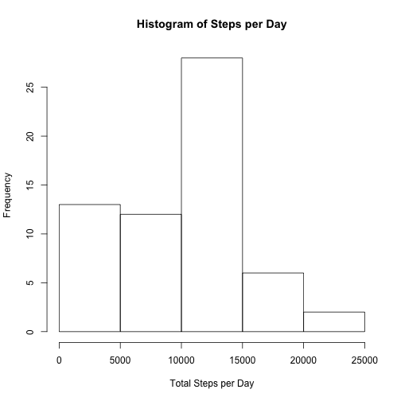
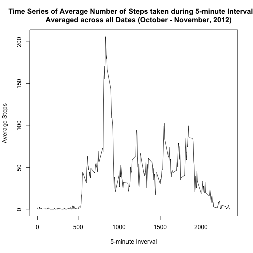
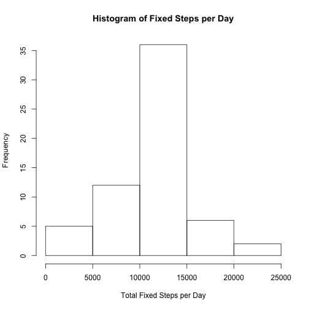
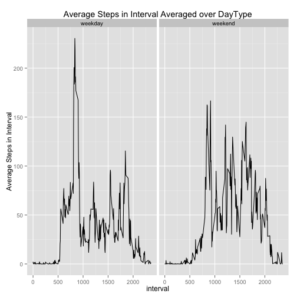

# Peer Assessment 1 *Reproducible Research*
## Gideon Reich

### Loading and Preprocessing the Data

The data consists of a zip file "repdata-data-activity.zip", which must be in 
an accessible directory. Inside the zip file is a csv file "activity.csv" which "contains data 
from a personal activity monitoring device. This device collects data at 5 
minute intervals through out the day. The data consists of two months of data 
from an anonymous individual collected during the months of October and
November, 2012 and include the number of steps taken in 5 minute intervals each
day." *Quoted from [Roger D. Peng, PhD, Jeff Leek, PhD, Brian Caffo, PhD, Peer Assessment Assignment 1, Reproducible Research, Coursera][1]*  

The first step is to unzip the file, and the load the extracted csv file in a
dataframe.


```r
getwd() # Check current working directory
```

```
## [1] "/Users/gidreich/Documents/Reproducible Research/Peer Review 1"
```

```r
# Change to directory where data is located
setwd("/Users/gidreich/Documents/Reproducible Research/Peer Review 1/")
getwd() # Verify directory change took effect
```

```
## [1] "/Users/gidreich/Documents/Reproducible Research/Peer Review 1"
```

```r
unzip("repdata-data-activity.zip") 
activity_df <- read.csv("./activity.csv") # read file
str(activity_df)  # output structure summary to confirm successful read
```

```
## 'data.frame':	17568 obs. of  3 variables:
##  $ steps   : int  NA NA NA NA NA NA NA NA NA NA ...
##  $ date    : Factor w/ 61 levels "2012-10-01","2012-10-02",..: 1 1 1 1 1 1 1 1 1 1 ...
##  $ interval: int  0 5 10 15 20 25 30 35 40 45 ...
```
### What is mean total number of steps taken per day?
In this part of the assignment we have do three things: 

1. Calculate the total number of steps per day.
2. Make a histogram of the total number of steps per day.
3. Calculate the mean and median of the total number of steps per day.

I like to use the dplyr package for "group by"-type operations and will use xtable to nicely display the result. The dplyr and xtable packages must be installed for this to work. So I will start by loading these libraries and using them for the first calculation.

```r
library(dplyr) # load library
```

```
## 
## Attaching package: 'dplyr'
## 
## The following objects are masked from 'package:stats':
## 
##     filter, lag
## 
## The following objects are masked from 'package:base':
## 
##     intersect, setdiff, setequal, union
```

```r
library(xtable)
```
Now on to the calculation. Missing values are removed. Results are shown for all 61 dates.

```r
## group by date and summarize, excluding missing values
TotalStepsPerDay <- group_by(activity_df,date) %>% 
        summarise(TotalSteps = sum(steps, na.rm=TRUE))
NiceFormatTotalStepsPerDay <- xtable(TotalStepsPerDay)
print(NiceFormatTotalStepsPerDay, type="html")
```

<!-- html table generated in R 3.2.1 by xtable 1.7-4 package -->
<!-- Sat Sep 19 12:32:08 2015 -->
<table border=1>
<tr> <th>  </th> <th> date </th> <th> TotalSteps </th>  </tr>
  <tr> <td align="right"> 1 </td> <td> 2012-10-01 </td> <td align="right">   0 </td> </tr>
  <tr> <td align="right"> 2 </td> <td> 2012-10-02 </td> <td align="right"> 126 </td> </tr>
  <tr> <td align="right"> 3 </td> <td> 2012-10-03 </td> <td align="right"> 11352 </td> </tr>
  <tr> <td align="right"> 4 </td> <td> 2012-10-04 </td> <td align="right"> 12116 </td> </tr>
  <tr> <td align="right"> 5 </td> <td> 2012-10-05 </td> <td align="right"> 13294 </td> </tr>
  <tr> <td align="right"> 6 </td> <td> 2012-10-06 </td> <td align="right"> 15420 </td> </tr>
  <tr> <td align="right"> 7 </td> <td> 2012-10-07 </td> <td align="right"> 11015 </td> </tr>
  <tr> <td align="right"> 8 </td> <td> 2012-10-08 </td> <td align="right">   0 </td> </tr>
  <tr> <td align="right"> 9 </td> <td> 2012-10-09 </td> <td align="right"> 12811 </td> </tr>
  <tr> <td align="right"> 10 </td> <td> 2012-10-10 </td> <td align="right"> 9900 </td> </tr>
  <tr> <td align="right"> 11 </td> <td> 2012-10-11 </td> <td align="right"> 10304 </td> </tr>
  <tr> <td align="right"> 12 </td> <td> 2012-10-12 </td> <td align="right"> 17382 </td> </tr>
  <tr> <td align="right"> 13 </td> <td> 2012-10-13 </td> <td align="right"> 12426 </td> </tr>
  <tr> <td align="right"> 14 </td> <td> 2012-10-14 </td> <td align="right"> 15098 </td> </tr>
  <tr> <td align="right"> 15 </td> <td> 2012-10-15 </td> <td align="right"> 10139 </td> </tr>
  <tr> <td align="right"> 16 </td> <td> 2012-10-16 </td> <td align="right"> 15084 </td> </tr>
  <tr> <td align="right"> 17 </td> <td> 2012-10-17 </td> <td align="right"> 13452 </td> </tr>
  <tr> <td align="right"> 18 </td> <td> 2012-10-18 </td> <td align="right"> 10056 </td> </tr>
  <tr> <td align="right"> 19 </td> <td> 2012-10-19 </td> <td align="right"> 11829 </td> </tr>
  <tr> <td align="right"> 20 </td> <td> 2012-10-20 </td> <td align="right"> 10395 </td> </tr>
  <tr> <td align="right"> 21 </td> <td> 2012-10-21 </td> <td align="right"> 8821 </td> </tr>
  <tr> <td align="right"> 22 </td> <td> 2012-10-22 </td> <td align="right"> 13460 </td> </tr>
  <tr> <td align="right"> 23 </td> <td> 2012-10-23 </td> <td align="right"> 8918 </td> </tr>
  <tr> <td align="right"> 24 </td> <td> 2012-10-24 </td> <td align="right"> 8355 </td> </tr>
  <tr> <td align="right"> 25 </td> <td> 2012-10-25 </td> <td align="right"> 2492 </td> </tr>
  <tr> <td align="right"> 26 </td> <td> 2012-10-26 </td> <td align="right"> 6778 </td> </tr>
  <tr> <td align="right"> 27 </td> <td> 2012-10-27 </td> <td align="right"> 10119 </td> </tr>
  <tr> <td align="right"> 28 </td> <td> 2012-10-28 </td> <td align="right"> 11458 </td> </tr>
  <tr> <td align="right"> 29 </td> <td> 2012-10-29 </td> <td align="right"> 5018 </td> </tr>
  <tr> <td align="right"> 30 </td> <td> 2012-10-30 </td> <td align="right"> 9819 </td> </tr>
  <tr> <td align="right"> 31 </td> <td> 2012-10-31 </td> <td align="right"> 15414 </td> </tr>
  <tr> <td align="right"> 32 </td> <td> 2012-11-01 </td> <td align="right">   0 </td> </tr>
  <tr> <td align="right"> 33 </td> <td> 2012-11-02 </td> <td align="right"> 10600 </td> </tr>
  <tr> <td align="right"> 34 </td> <td> 2012-11-03 </td> <td align="right"> 10571 </td> </tr>
  <tr> <td align="right"> 35 </td> <td> 2012-11-04 </td> <td align="right">   0 </td> </tr>
  <tr> <td align="right"> 36 </td> <td> 2012-11-05 </td> <td align="right"> 10439 </td> </tr>
  <tr> <td align="right"> 37 </td> <td> 2012-11-06 </td> <td align="right"> 8334 </td> </tr>
  <tr> <td align="right"> 38 </td> <td> 2012-11-07 </td> <td align="right"> 12883 </td> </tr>
  <tr> <td align="right"> 39 </td> <td> 2012-11-08 </td> <td align="right"> 3219 </td> </tr>
  <tr> <td align="right"> 40 </td> <td> 2012-11-09 </td> <td align="right">   0 </td> </tr>
  <tr> <td align="right"> 41 </td> <td> 2012-11-10 </td> <td align="right">   0 </td> </tr>
  <tr> <td align="right"> 42 </td> <td> 2012-11-11 </td> <td align="right"> 12608 </td> </tr>
  <tr> <td align="right"> 43 </td> <td> 2012-11-12 </td> <td align="right"> 10765 </td> </tr>
  <tr> <td align="right"> 44 </td> <td> 2012-11-13 </td> <td align="right"> 7336 </td> </tr>
  <tr> <td align="right"> 45 </td> <td> 2012-11-14 </td> <td align="right">   0 </td> </tr>
  <tr> <td align="right"> 46 </td> <td> 2012-11-15 </td> <td align="right">  41 </td> </tr>
  <tr> <td align="right"> 47 </td> <td> 2012-11-16 </td> <td align="right"> 5441 </td> </tr>
  <tr> <td align="right"> 48 </td> <td> 2012-11-17 </td> <td align="right"> 14339 </td> </tr>
  <tr> <td align="right"> 49 </td> <td> 2012-11-18 </td> <td align="right"> 15110 </td> </tr>
  <tr> <td align="right"> 50 </td> <td> 2012-11-19 </td> <td align="right"> 8841 </td> </tr>
  <tr> <td align="right"> 51 </td> <td> 2012-11-20 </td> <td align="right"> 4472 </td> </tr>
  <tr> <td align="right"> 52 </td> <td> 2012-11-21 </td> <td align="right"> 12787 </td> </tr>
  <tr> <td align="right"> 53 </td> <td> 2012-11-22 </td> <td align="right"> 20427 </td> </tr>
  <tr> <td align="right"> 54 </td> <td> 2012-11-23 </td> <td align="right"> 21194 </td> </tr>
  <tr> <td align="right"> 55 </td> <td> 2012-11-24 </td> <td align="right"> 14478 </td> </tr>
  <tr> <td align="right"> 56 </td> <td> 2012-11-25 </td> <td align="right"> 11834 </td> </tr>
  <tr> <td align="right"> 57 </td> <td> 2012-11-26 </td> <td align="right"> 11162 </td> </tr>
  <tr> <td align="right"> 58 </td> <td> 2012-11-27 </td> <td align="right"> 13646 </td> </tr>
  <tr> <td align="right"> 59 </td> <td> 2012-11-28 </td> <td align="right"> 10183 </td> </tr>
  <tr> <td align="right"> 60 </td> <td> 2012-11-29 </td> <td align="right"> 7047 </td> </tr>
  <tr> <td align="right"> 61 </td> <td> 2012-11-30 </td> <td align="right">   0 </td> </tr>
   </table>
     
      
The trouble with tables of this size and bigger is that it gets ever more difficult to spot interesting patterns. However, we should see more in the histogram, which I generate below.


```r
hist(TotalStepsPerDay$TotalSteps, main = "Histogram of Steps per Day",
     xlab = "Total Steps per Day")
```

 

Finally, we would like to see the mean and median of the total number of steps
per day.


```r
meanTotalSteps <- mean(TotalStepsPerDay$TotalSteps)
medianTotalSteps <- median(TotalStepsPerDay$TotalSteps)
```

This is done using the code shown above The mean is 9354.2295082 and the median is 10395.

### What is the average daily activity pattern?

For this part of the assignment we need to do two things. First, we need to make a time series plot (i.e. type = "l") of the 5-minute interval (x-axis) and the average number of steps taken, averaged across all days (y-axis)

I will start by calculating the average steps per interval over all dates and plotting the result. I will do so using dplyr functions group_by and summarise, followed
by the plot function.


```r
AvgStepsPerInterval <- group_by(activity_df,interval) %>% 
        summarise(AverageSteps = mean(steps, na.rm=TRUE))
plot(AvgStepsPerInterval$interval, AvgStepsPerInterval$AverageSteps, type="l",
     main="Time Series of Average Number of Steps taken during 5-minute Intervals,
     Averaged across all Dates (October - November, 2012)", xlab="5-minute Inverval", ylab="Average Steps")
```

 

Next, there is this question:

Which 5-minute interval, on average across all the days in the dataset, contains the maximum number of steps?

It seems clear from the above plot that this value is between 500 and 1000. We can calculate the maximum using the following code.


```r
# find the maximum average number of steps 
# then locate the interval for which this is the average 

maxAvgSteps <- max(AvgStepsPerInterval$AverageSteps)
maxAverageInterval_df <- filter(AvgStepsPerInterval, AverageSteps == maxAvgSteps)

maxAverageInterval <- maxAverageInterval_df[[1]]
```

The interval with the maximum average number of steps is 835. 
This is consistent with what we saw in the plot.

### Imputing missing values

We will now deal with the missing values which we have been excluding so far. How many are there? I will sum the is.na() values of the steps column in the data frame.


```r
NumMissing <- sum(is.na(activity_df$steps))
```

The number of missing values is 2304.

Next we are requested to come up with a simple way to fill in all of the missing values and store the result in a new dataset. I choose to use the mean of the missing interval, i.e., average for the interval across all dates that I calculated above. I confirm the absence of missing values and show the structure/summary of the new dataset.


```r
# first merge data frame with average steps per interval
# (this is like a database join on interval between the two tables)
activity_no_missing_df <- merge(activity_df, AvgStepsPerInterval) 

# assign to steps with missing values, the corresponding 
# average steps for the interval
activity_no_missing_df$steps[is.na(activity_no_missing_df$steps)] <-
        activity_no_missing_df$AverageSteps[is.na(activity_no_missing_df$steps)]

# how many missing values now?
missingNow <- sum(is.na(activity_no_missing_df$steps))

str(activity_no_missing_df)
```

```
## 'data.frame':	17568 obs. of  4 variables:
##  $ interval    : int  0 0 0 0 0 0 0 0 0 0 ...
##  $ steps       : num  1.72 0 0 0 0 ...
##  $ date        : Factor w/ 61 levels "2012-10-01","2012-10-02",..: 1 54 28 37 55 46 20 47 38 56 ...
##  $ AverageSteps: num  1.72 1.72 1.72 1.72 1.72 ...
```

The number of missing records in the new data frame is 0.

The last part of this section requires making a histogram of the total steps per day based on the new dataset, finding the new median and mean, and comparing it to the original.


```r
TotalFixedStepsPerDay <- group_by(activity_no_missing_df,date) %>% 
        summarise(TotalSteps = sum(steps))
                  
hist(TotalFixedStepsPerDay$TotalSteps, main = "Histogram of Fixed Steps per Day",
     xlab = "Total Fixed Steps per Day")
```

 

```r
# I store the values of the new mean and median for printing below
meanTotalFixedSteps <- mean(TotalFixedStepsPerDay$TotalSteps)
medianTotalFixedSteps <- median(TotalFixedStepsPerDay$TotalSteps)

# I store the resultant change from the previous mean and median for printing
if (meanTotalFixedSteps > meanTotalSteps) {change_in_mean <- "increased"} else
        change_in_mean <- "decreased"

if (medianTotalFixedSteps > medianTotalSteps) {change_in_median <- "increased"} else 
        change_in_median <- "decreased"
```

The new mean is 1.0766189 &times; 10<sup>4</sup> and the new median is 1.0766189 &times; 10<sup>4</sup>. Thus, the new mean has increased and the new median has increased. I'm not sure why but in all my runs, the new mean is equal to the new median, even though that was not the case with the old mean and old median. 

### Are there differences in activity patterns between weekdays and weekends?

For the last part of the assignment we need to use the filled in dataset add a column that specifies whether the date is a weekday or weekend.


```r
# step 1 get the days of the week
activity_no_missing_df <- mutate(activity_no_missing_df, dayofweek = weekdays(as.Date(date)))
# step 2 assign "weekday" to all days as "daytype"
activity_no_missing_df <- mutate(activity_no_missing_df, daytype =  "weekday")
# step 3 for weekends, defined as Saturday/Sunday, assign "weekend" for daytype
activity_no_missing_df[activity_no_missing_df$dayofweek=="Saturday" | activity_no_missing_df$dayofweek=="Sunday",]$daytype <- "weekend"
# step 4 make daytype a factor
activity_no_missing_df <- mutate(activity_no_missing_df,daytype= factor(daytype))
# step 5 group_by daytype and get average number of interval steps for same
activity_for_daytype <- group_by(activity_no_missing_df, daytype, interval) %>% summarize(AverageStepsPerDayType = mean(steps))
```

Finally, I will use ggplot to make a panel plot of interval vs the average number of steps taken with weekdays in one panel and weekend in another.


```r
library(ggplot2) #load library (must be installed)
```

```
## Need help? Try the ggplot2 mailing list: http://groups.google.com/group/ggplot2.
## 
## Attaching package: 'ggplot2'
## 
## The following object is masked _by_ '.GlobalEnv':
## 
##     diamonds
```

```r
p <- qplot(interval, AverageStepsPerDayType, data = activity_for_daytype, facets = .~daytype, ylab="Average Steps in Interval",
            main="Average Steps in Interval Averaged over DayType", geom="line")
print(p)
```

 

[1]: https://class.coursera.org/repdata-032/human_grading/view/courses/975145/assessments/3/submissions "Peer Assessment 1"
